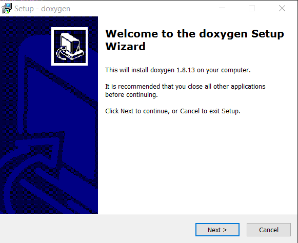
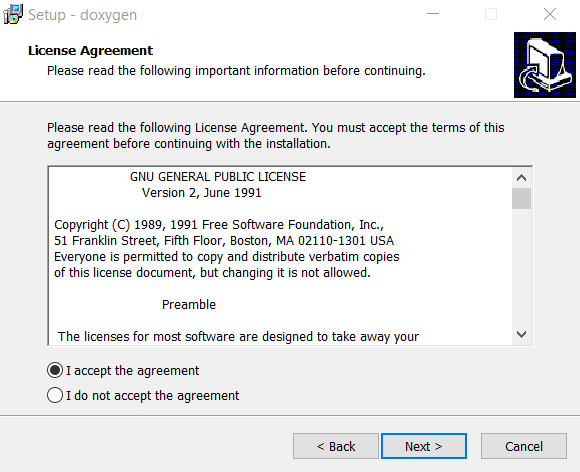
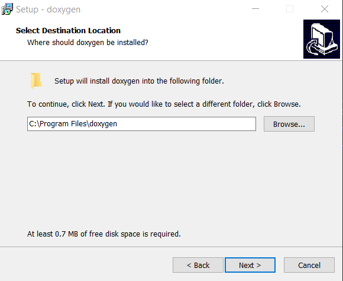
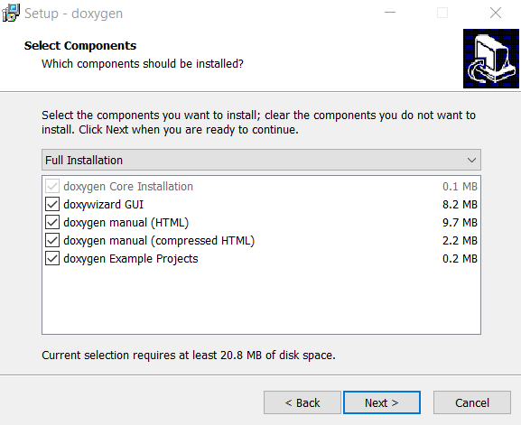
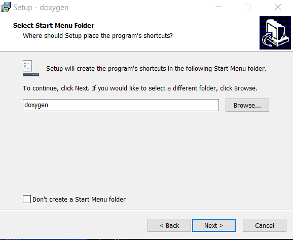
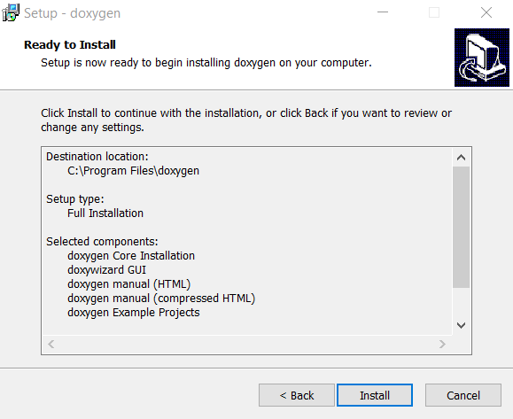
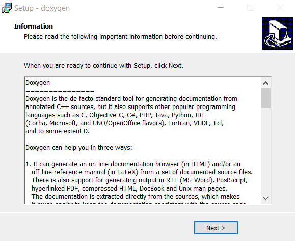
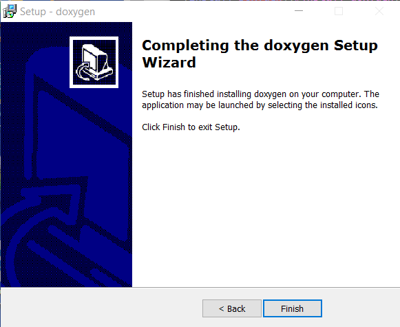

# Development Environment / Doxygen

Doxygen is a software tool for generating documentation from code comments.
This eliminates the need to create code documentation outside of code.
Doxygen also creates diagrams that illustrates how code modules call each other.
See the following resources:

* [Doxygen website](http://www.stack.nl/~dimitri/doxygen/)
* [Doxygen download page](http://www.stack.nl/~dimitri/doxygen/download.html)

This documentation includes the following sections:

* [Install Doxygen](#install-doxygen)
	+ [Linux](#linux)
	+ [Windows](#windows)

## Install Doxygen

### Linux

**TODO smalers 2016-12-31 this documentation will be completed once the Windows documentation is complete.**

### Windows

Download the Doxygen Windows installer from the download page, which will have a name similar to `doxygen-1.8.13-setup.exe`.
Run the installer as administrator and complete the following steps.

## Configure Doxygen Project

**TODO smalers 2017-01-01 need to document based on StateMod HowTo document**
