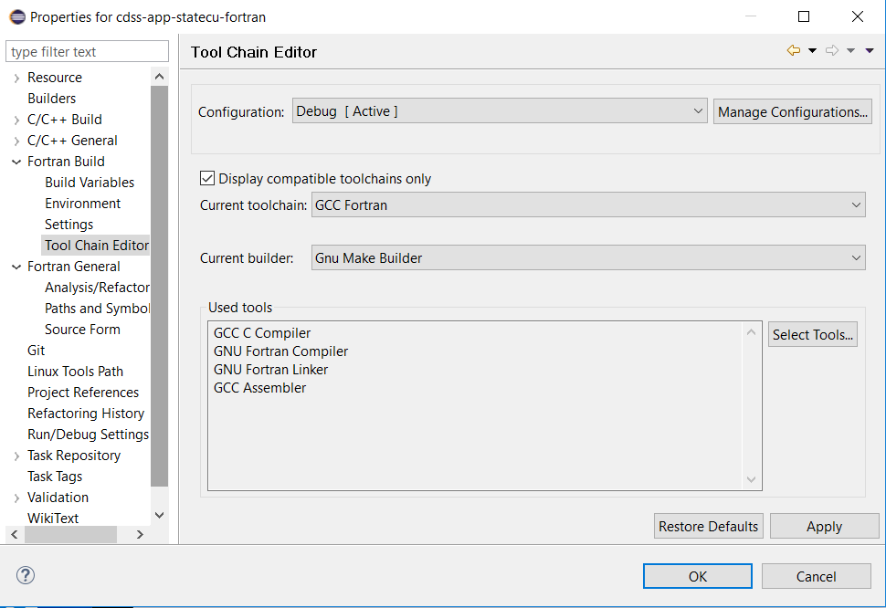

# Initial Project Setup / Eclipse Environment

Eclipse must be made aware of where `gfortran`, `make`, etc. are located.

## Linux 

## Windows

It appears that Eclipse is relatively intelligent in this regard, assuming that the MingGW software is in the `PATH`,
as configured by the setup batch file.
For example, selecting the `cdss-app-statecu-fortran` project in the Eclipse ***Project Explorer*** and then right-clicking
and selecting ***Properties*** shows the following:

