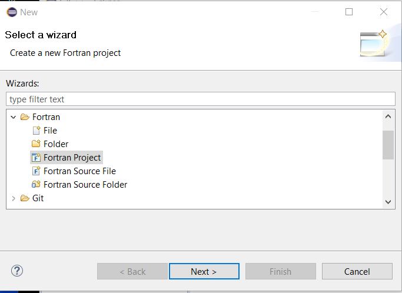
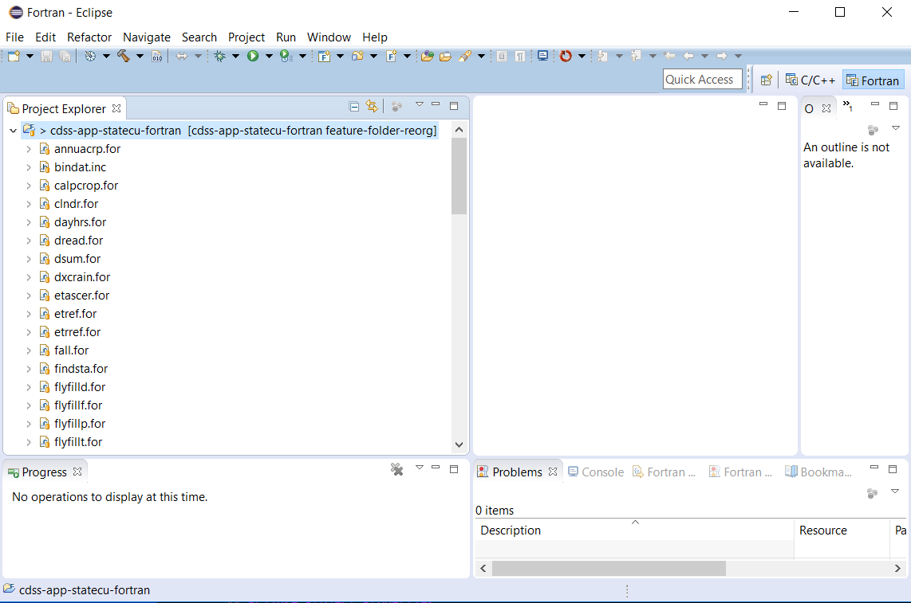

# Initial Project Setup / Eclipse StateCU Project

The Eclipse workspace is a container for one or more Eclipse projects.
Each project can have multiple characteristics, for example the programming language, whether managed in a repository, etc.
Typically multiple projects are used in cases where library components are developed with an application,
or if tests, documentation, etc. are split into separate projects.
It is convenient to have one-to-one correspondence between project and Git repository and to make sure each project focuses on one language.
The following resources are useful:

* [Eclipse Mars Fortran Development User Guide](http://help.eclipse.org/mars/index.jsp?topic=%2Forg.eclipse.photran.doc.user%2Fhtml%2Fbasic%2FStartingNewProject.html)

This documentation contains the following sections:

* [Import Git Repository as Project](#import-git-repository-as-project)
* [Eclipse Project Properties](#eclipse-project-properties)
* [Creating a Make Target](#creating-a-make-target)

## Import Git Repository as Project

Because the existing StateCU code exists in a Git repository that was migrated from an existing repository,
the project can be initialized from the repository, as described below.

First use ***File / New / Other...*** and select ***Fortran / Project*** as shown below.

The following dialog will be shown to configure the dialog.
Because a custom makefile will be used to compile the software, select ***Makefile Project / Empty Project*** as shown below:

Press ***Next >***

Press ***Finish***

Press ***OK*** since this is a new project and Eclipse project files have not previously been created within the repository files.

Press ***Yes***

Note that Eclipse automatically detects that the files are a Git repository (yellow barrel decorators on files and repository name in square brackets).

Adjust the folders to match the desired [developement files folder structure](overview#development-folder-structure), as shown below:

## Eclipse Project Properties

Eclipse must be made aware of where `gfortran`, `make`, etc. are located.

### Linux 

### Windows

It appears that Eclipse/Photran is relatively intelligent in this regard, assuming that the MingGW software is in the `PATH`,
as configured by the setup batch file.
For example, selecting the `cdss-app-statecu-fortran` project in the Eclipse ***Project Explorer*** and then right-clicking
and selecting ***Properties*** shows the following:

## Creating a Make Target

First, the makefile apparently must be named `makefile` in order for Eclipse to find (it must run `make sometarget`).
If the makefile has a different name, the build command needs to be changed to `make -f makefile-name`.
However, it is easier to just make sure the makefile is named `makefile`.

To compile the software it is necessary to create a Make Target.  Click on the project in the ***Project Explorer***
and then select ***Make Targets / Create***, which displays the following:

The typical use seems to be to define make targets that are consistent with the targets in the file.
Therefore create make targets for `clean`, `all`, etc., similar to the following:

Then, to run a target, right click and use ***Make Targets / Build...***, select a target in the dialog, and ***Build***.
